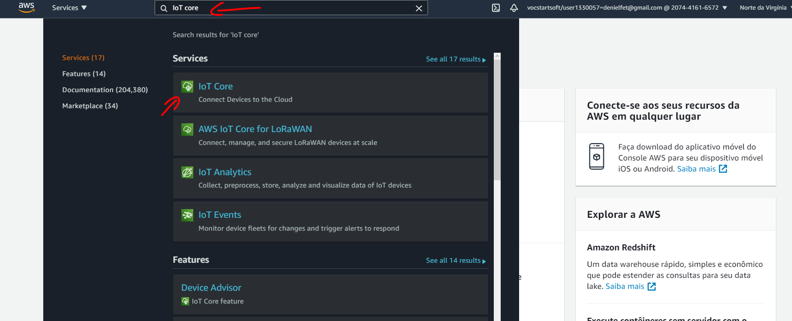

# sd_pbl2
# Relatorio de sistema

#entrando no IoT core

primeiramente precisamos registra a nossa coisa no AWS e pega os certificados para podermos conectala no MQTT do aws. Para isso vamos logar na nossa conta. Entao procuramos por "IoT core"como na imagem a baixo:



#criando politica

vamos em proteger, em politicas e em criar:


colocamos um nome em nossa politica ( para o exemplo demos o nome de politicaNodeMcu ) e colocamos * em ação, marcamos permitir na checkbox e clicamos em criar:


# Registando a coisa no aws

Entao no menu lateral vamos em gerenciar, depois em coisas e por fim criar:


Para registrar a coisa clicamos em criar uma única coisa:


Entao escolhemos um nome para a coisa ( no exemplo foi escolhido node_mcu) e cliclamos em proximo:


clicamos entao em criar certificados:


Entao fazemos o download de todos os certificados e o do nosso CA da amazon ( esses arquivos sao importantes e nao devem ser compartilhadas ou perdidos ), ao clicarmo me fazer download do CA da amazon vamor ser levados a outra pagina:


nessa nova pagina vamos salvar o conteudo do amazon root CA 1 como arquivo de texto junto dos certificados. para tal clicamos com o direito em salvar conteudo do link como:


entao cliclamos em ativar e axenar uma politica:


Selecionamos a politica que criamos e em registra a cosia:


#upando o codigo na placa

entao faremos o download do codigo do git na nossa maquina:


colocamos 1 copia de todos os certificados e do AmazonRootCA na pasta:  "sd_pbl2/arduino/certificados" e na pasta "sd_pbl2/IoT/certificates".
entao abrimos o pronpt de comando na pasta "sd_pbl2/arduino/certificados" e digitamos:

```
openssl x509 -in {nome_do_arquivo_de_certificado} -out crt.der -outform DER
openssl rsa -in {nome_do_do_arquivo_da_private_key} -out private.der -outform DER
openssl x509 -in AmazonRootCA1.pem -out ca.der -outform DER
```

assim geramos os arquivos dos certificados que serao upados na placa.

Caso esse passo nao de cereto pode ser nescessario baixa e instala o OpenSSL.

Ao terminarmos esse passo na nossa pasta "sd_pbl2/arduino/certificados" devemos ter 7 arquivos: os 4 que baixamos do aws + ca.der + crt.der + private.der
Entao movemos estes 3 arquivos que foram criados para a uma pasta "sd_pbl2/arduino/data". Ao terminarmos esses passos nossas pastas dentro de "sd_pbl2"/arduino" devem esta dessa forma:

```
-certificados
--{Certificado_baixado_do_aws}
--{chave_privada_baixado_do_aws}
--{chave_publica_baixado_do_aws}
--AmazonRootCA1.pem
-data
--ca.der
--crt.der
--private.der
-arduino.ino
```

entao voltamos para a pasta "sd_pbl2/arduino" e abrimos o codigo. ( caso nao tenha instalado instale a ultima versao da IDE do arduino ou atualise caso desatualizada ). E iremos em ferramentas, placa e por fim gerenciador de placas...:


Sera aberto uma janela e na barra de busca digitaremos: "EPS8266", e clicaremos em instala no elemento "esp8266":


Apos ter terminado de instala ao clicarmos em ferramentas, placa, ESP8266 e por fim em NodeMCU 1.0:


Entao com a placa conectada ao computador garantimos que os dados serao enviado pro lugar correto, em ferramentas vamos em porta e selecionamos a pota na qual a placa esta ( no exemplo indicado pelas setas pretas ) e por fim clicamos em ESP8266 Sketch Data Upload ( indicado pela seta vermelha:


Ao realizarmos isso estaremos upando os aquivos da pasta data para a placa e entao alteramos no codigo do arduino as variaveis: id_rede, senha_rede e AWS_endpoint.


caso nao saiba seu endpoint no aws basta ir em , na tela do IoT core e em configurações e la voce encontrara o endpoint.

IMG

Tambem sera nescessario baixa 3 bibliotecas do arduino, para isso na IDE do arduino vamos em sketch, incluir biblioteca e gerenciar bibliotecas...:


Entao sera aberno uma janela e nela vamos digita o nome da biblioteca e clicar em instala, repetindo esse processo para todas as bibliotecas que nao tivernos. Sendo nescessario baixar:

-PubSubClient
-NTPClient
-ArduinoJson

aqui temos um exemplo da instalação da biblioteca ArduinoJson:


Agora podemos upar o sketch para a placa pelo botao que contem uma seta no topo do menu:


#Criando maquina virtual

Para uparmos o servidor vamos de volta ao AWS e dessa vez abrimos o EC2 ao invez do IoT, para abrirmos o EC2 o passo é similar ao do IoT core porem dessa vez buscamos por EC2 no lugar de IoT core.

Entao vamos em instancias, instancias e executar instância:


Vamos em AMIs da comunidade, Ubuntu e selecionamos a primeira ( Ubunu-focal-20.04) : 


Selecionamos a instancia que queremos, nesse projeto o servido sera rodado na instancia t2.micro ) e clicamos para ir em configure os security group:


Deixamos marcado Criar um grupo de segurança novo, clicamos em add rule 2 vezes, e colocamos 1 das caixas adicionadas com HTTP e outra como HTTPS:


Entao clicamos em verificar e ativar no canto inferior direito.

Na nova tela que somos levados clicamos em executar. E vai aparecer para escolhermos uma chave, caso ja tenha 1 basta colocar na dropbox "Escolher um par de chaves existentes", para criar um par basta ir em na dropbox e colocar "Criar um novo par de chaves" e colocar o nome para essa chave no campo de baixo e clicar em download ( no exemplo colocamos o nome chave ), apos fazer o download o botao executar instancia estara disponivel e basta clicar nele:


Entao seremos redirecionamos para uma pagina mostrando que a instancia foi lançada e clicaremos em exibir instancai:


Entao iremos a pagina onde temos nossas isntancias e clicaremos no nome da instancia que acabamos de criar, caso haja varias instancias basta filtra pela "Data de lançamento" e seleciona a mais recente

Entao ao clicarmos no nome da instancia que acabamos de criar seremos jogados em uma pagina da instancia, entao anotaremos o endereço de IPv4 publico da instancia e clicaremos em "Conectar":


Entao clicaremos em cliente SSH e copiaremos o exemplo:


#upando o servidor

Entao para usuarios linux abriremos a pasta que tem a chave que aabamos de baixa e executaremos o comando que copiamos e precionar enter, para windowns recomenda-se baixar o git bash e executar o git bash na pasta que foi colocada a chave baixada e colar o comando copiado e dar enter:


Entao digitamos yes e precionamos enter para adiciona essa maquina a hosts conhecimos e por fim estaremos dentro da maquina.

A principio digitaremos os seguntes comandos para atualiza o SO:

```
sudo apt update
```

e apos o termino

```
sudo apt upgrade -y
```

para realizar todas as atualizações. Entao faremos :

```
git clone {link desse github}
```

e 

```
sudo apt install python3-pip
```

abrimos a pasta "sd_pbl2" com:

```
cd sd_pbl2/
```

e executamos:

```
sudo pip3 install -r requirements.txt
```

assim todos os pactes python serao instalados. entao vamos para a o arquvio views.py na pasta IoT fazendo:

```
cd IoT/
nano views.py
```

e editamos trocamos o valo de __base_url__ pelo valor do IPv4 publico da nossa maquina, que anotamos alguns passos anteriore:

```
...

__base_url__='{seU_IPv4}'

def listar(request):
...

```

Neste exeplo o ip da maquina é 54.205.211.76, entao colocamos esse valor entre aspas la:


entao salvamos e saimos ( pode ser feito com ctrl+x escolhendo a opção 'y' e dando enter ). Tambem precisamos upar nossos certificados no servidor ( pode tambem ser editado nos arquivos locais e upa esses arquivos no git ao invez de baixa direto desse git se baixa do que voce upou ). apos eles terem sido upados para la é nescessario que abramos o arquivo MQTT.py ( que se encontra na mesma pasta que estamos, a pasta do views.py ) com o comando:

```
nano MQTT.py
```

e editemos o path dos certificados e o colocamos nosso endpoint do AWS:

```

...
client.configureEndpoint("{seu_end_point_do_aws}", 8883)
client.configureCredentials("{path do /AmazonRootCA1.pem}",
                            "{path_da_private_key}",
                            "{path_do_certificado}")

client.connect()
...
```

pois sem esses dados nao sera poscivel usar o MQTT broker do AWS, para achar o path dos arquivos no servidor basta digita o comando "pwd" estando na pasta dos paths que entao sera escrito no terminal o path dessa pasta, bastando so adiciona o "/{nome_do_arquivo}" para se ter o caminho do mesmo. E entao voltamos uma pasta com:

```
cd ..
```

e executamos o seguinte comando:

```
sudo python3 manage.py runserver 0.0.0.0:80
```

Assim abrimos o servidor na porta :80 da maquina aberta para qualquer um acessar
entao basta colocar o IPv4 da maquina do seu broser e vc estara acessando o site, garanta que esta acessando a porta 80 digitando: " HTTP://{IPv4} ".


assim abrimos o site, ele ja vem com alguns dados pre colocados como por exemplo a coisa Lampada1 adicionada, 2 temporizadores para ela e algums dias de historico para mostra que esta tudo funcionando ok. Para mais informaçoes sobre a pagina olha o manual de Usuario
