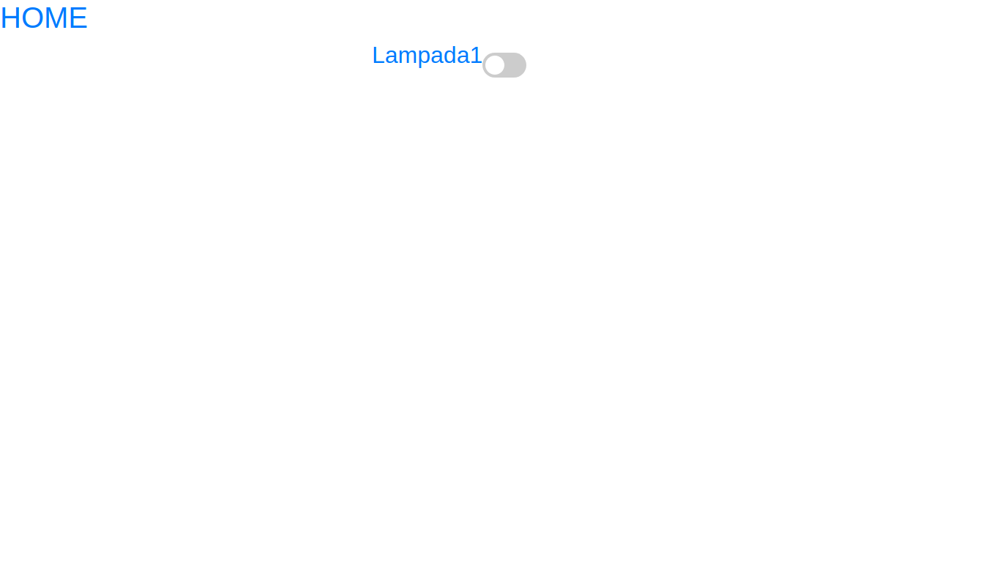
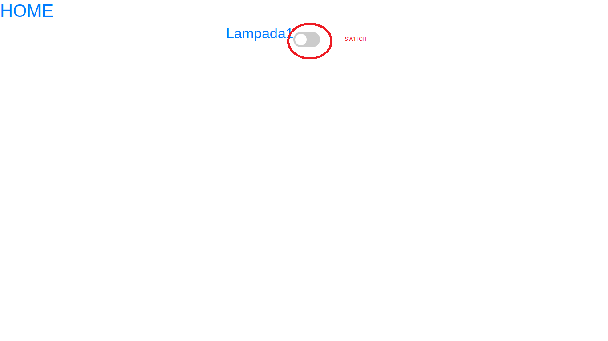
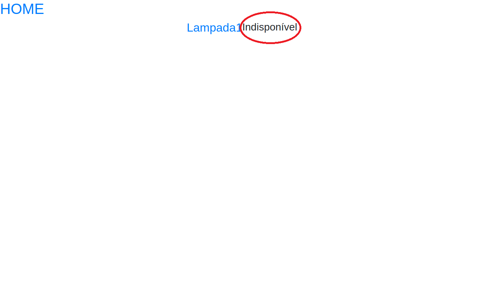
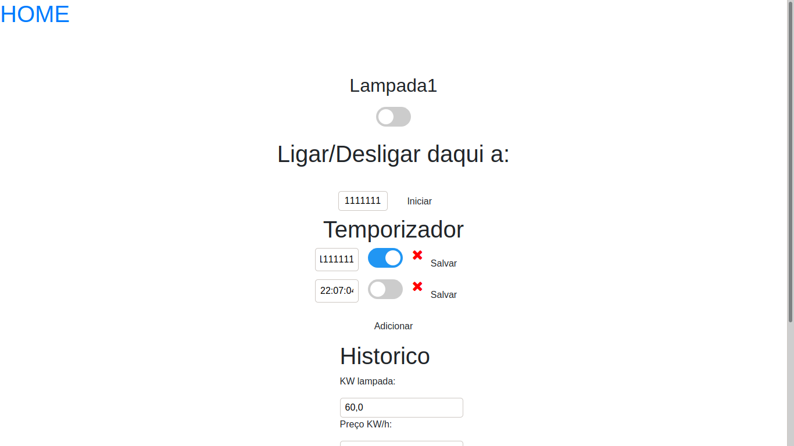
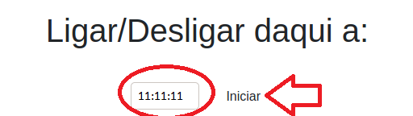
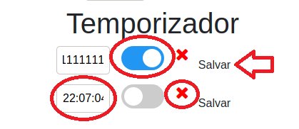
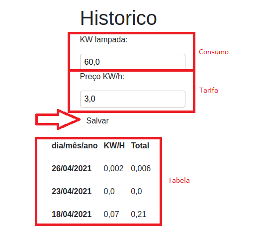

#Manual do Usuário

##1. Pré-Requisistos
- Conexão com a Internet;
- Sistema Operacional;
- Navegador.

##2. Acesso ao sistema
- Para acessar o site, digite a seguinte URL em seu navegador: http://54.197.122.189/ ;
- Deverá aparecer a seguinte tela.

##3. Tela inicial
- No botão Switch podemos ligar ou desligar a lâmpada de maneira fácil;

- Caso a lâmpada esteja indisponível, será mostrado no lugar do botão Switch.

- Apertando no nome da lâmpada você será redirecionado para a Tela Geral;

##4. Tela geral
- Nesta tela temos todas as informações e funcionalidades do sistema.

##5. Ligar/Desligar Lâmpada
- Apertando no switch, podemos ligar ou desligar a lâmpada.

##6. Tempo para Ligar/Desligar
- Para ativar esta funcionalidade, basta inserir o tempo desejado, ativar no Switch e apertar o botão INICIAR, logo, sua lâmpada mudará de estado após esse período.

##7. Temporizador
- Para ativar esta funcionalidade, basta inserir os horários desejados, ativar no Switch e apertar o botão SALVAR, logo, sua lâmpada ficará ligada durante o período de tempo especificado;

- No X, podemos remover o temporizador desejado;
- Só poderão ser cadastrados 10 temporizadores.

##8. Histórico Mensal
- Nesta seção é possível inserir o valor do consumo em KWh;
- Também é possível inserir o valor da tarifa para calcular os valores de custo;
- Após isso, clique em SALVAR;
- Por último, há uma tabela de registro de consumo dos últimos 30 dias.
